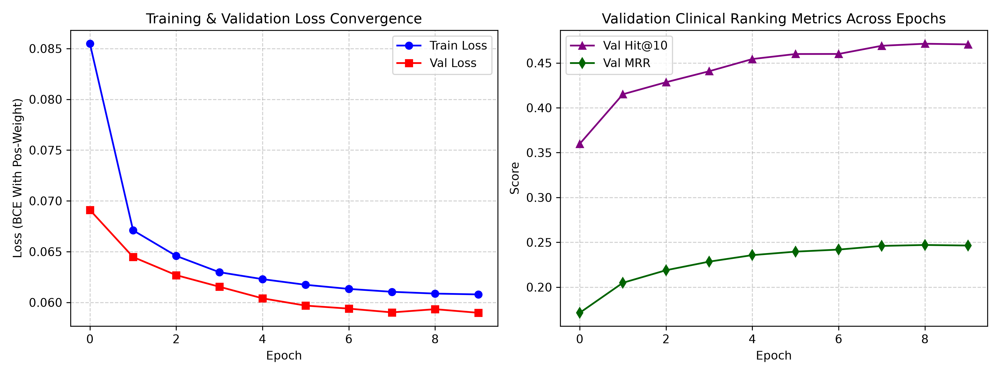
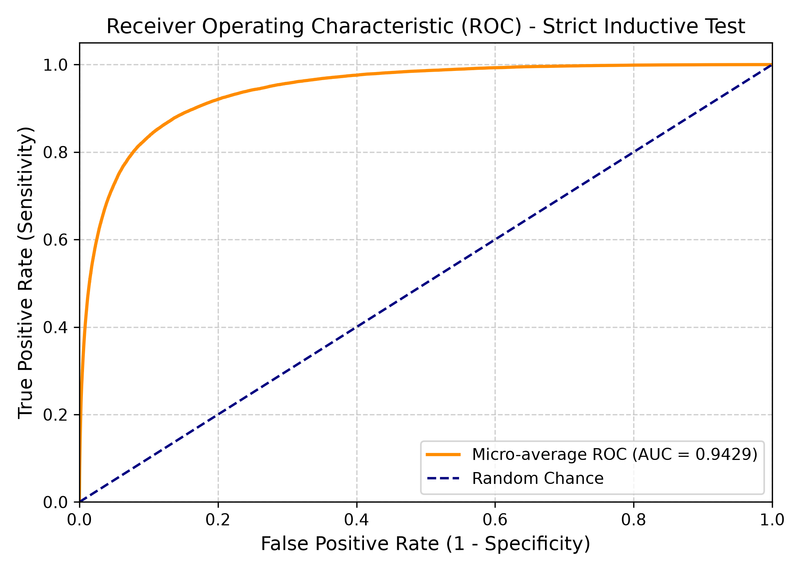
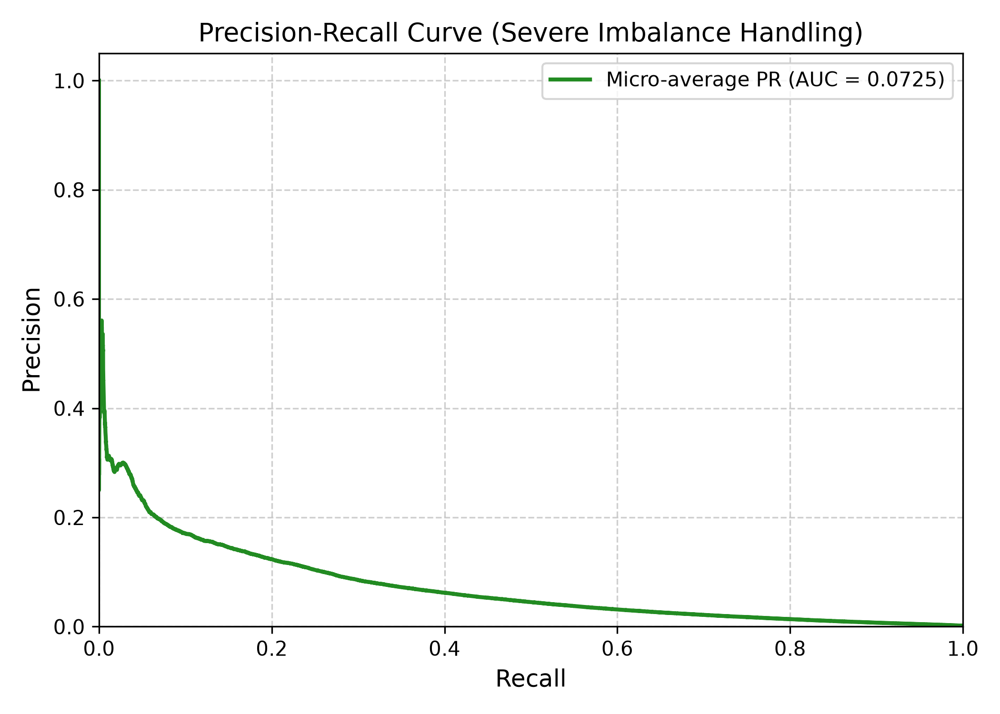

# Predicting Adverse Events Based on Reported Medication Use

[](https://www.python.org/)
[](https://pytorch.org/)
[](https://pyg.org/)
[](https://www.nvidia.com/)
[](https://opensource.org/licenses/MIT)

> **CSE3050 Project**  
> **Authors**: Luong Chi Dung (`24110215@st.vju.ac.vn`) & Do Tien Dat (`24110211@st.vju.ac.vn`)  
> **Affiliation**: Faculty of Advanced Technology and Engineering, Viet Nam Japan University (VJU)  
> **Paper**: [Predicting Adverse Events Based on Reported Medication Use (PDF)](https://drive.google.com/file/d/18FuHV5Ys1Z6N652bXiCrweuhsNK8_WDB/view?usp=drive_link)

---

## 1. Overview & Motivation

Pharmacovigilance is critical for post-marketing surveillance of medicines and vaccines. In Australia, the primary reporting instrument is the **Database of Adverse Event Notifications (DAEN)**, maintained by the Therapeutic Goods Administration (TGA), containing over 600,000 adverse event reports dating back to 1971.

Real-world pharmacovigilance data presents fundamental challenges:
1. **Unconfirmed Causality**: Reports reflect *suspected* associations rather than definitive clinical proof.
2. **Missing Denominators**: Total drug exposure in the general population is unknown, meaning simple event counts cannot establish true incidence rates.
3. **Severe Sparsity & High Dimensionality**: Thousands of distinct active ingredients and over 10,000 standardized MedDRA reaction terms.
4. **Clinical Alert Fatigue**: Naive frequency screening generates numerous false alarms, overwhelming clinical reviewers.

This project implements **HeteroPharmacovigilanceNet**, an end-to-end Heterogeneous Graph Neural Network designed to learn semantic representations across **Patients**, **Drugs**, and **Adverse Reactions** to accurately predict and rank a patient's adverse reaction risks given their demographic profile and reported medication regimen.

---

## 2. Key Architectural Fixes & Improvements

The initial prototype in earlier milestone notebooks suffered from critical limitations:
- **Catastrophic Target Leakage**: The target patient-reaction edges were fed into the input message-passing graph, causing the model to use the target reaction as an input shortcut.
- **Corrupted Demographic Features**: Continuous age and gender were incorrectly appended as dummy drug nodes, losing the continuous age values and female signals.
- **1-Negative Sample Evaluation**: Testing link prediction against only 1 random negative reaction created a misleading illusion of 99% accuracy.

### Our Solution
- **Strictly Inductive Graph**: The target adverse events for evaluated patients are **100% excluded** from the input graph and encoders.
- **Dedicated Demographic Projection**: Age (standardized + missingness indicator) and Sex (one-hot categorical) are encoded via a dedicated multi-layer perceptron.
- **Bipartite Knowledge Graph**: A 482,877-edge historical Drug $\leftrightarrow$ Reaction graph is extracted strictly from the training cohort.
- **Causality-Weighted Attention**: Aggregates patient medications using attention modulated by reported causality (**Suspected = 2.0**, **Concomitant = 1.0**).
- **True Multi-Label Clinical Ranking**: Evaluated across all 1,824 candidate reactions using Hit@K, MRR, and NDCG.

---

## 3. System Architecture

```text
[Raw DAEN Workbooks] (DAEN/List of Reports_1..5.xlsx, ~680k rows)
       │
       ▼  (src/preprocess.py - Rust Calamine Engine, 43.3s)
[Processed Cohort] (666,305 patients, 2,623 drugs, 1,824 reactions >96% coverage)
       │
       ├── Train Split (466,413) ──► Extract Bipartite Knowledge Graph (482,877 edges)
       ├── Val Split   (99,945)
       └── Test Split  (99,947)  (Strictly disjoint test patients)
               │
               ▼
   [HeteroPharmacovigilanceNet] (src/model.py)
   ├── KG GNN: 2-layer Graph Attention over historical Drug <-> Reaction co-occurrences
   ├── Patient Encoder:
   │     ├── Demographic MLP: [Age_norm, Age_missing, Is_Female, Is_Male, Is_Other]
   │     └── Attentive Drug Pooling: Softmax attention weighted by Causality (Suspected=2 vs Concomitant=1)
   └── Multi-Label Dual Decoder: Logit = z_patient^T * h_reaction + b_reaction
               │
               ▼  (src/train.py - Ampere GPU, Mixed Precision, Cosine LR)
   [Model Checkpoint] (checkpoints/best_model.pt)
               │
               ▼  (src/evaluate.py & demo.py)
   [Clinical Metrics & Personal Drug Safety Assistant CLI]
```

---

## 4. Empirical Evaluation Results

Evaluated on the held-out test cohort (evaluating over 45,000,000 patient-reaction pairs in 2.2 seconds):

### Clinical Ranking & Discriminative Metrics

| Metric | Score | Clinical Interpretation |
| :--- | :---: | :--- |
| **Micro ROC-AUC** | **0.9429** | Superior global discriminative separation across all 1,824 candidate reactions |
| **Hit@5** | **35.65%** | A true adverse event is present in the Top 5 predicted side effects |
| **Hit@10** | **46.61%** | Nearly half of all patients have their true adverse event in the Top 10 |
| **Hit@20** | **58.76%** | Over 58% of patients have their true event in the Top 20 |
| **Hit@50** | **73.87%** | Nearly 3 in 4 patients have their true event in the Top 50 |
| **MRR (Mean Reciprocal Rank)** | **0.2552** | On average, the first true adverse event appears around **rank 3.9** |
| **NDCG@10** | **0.2137** | Strong ranking gain in the top 10 clinical slots |

### Evaluation Plots

#### Training & Validation Convergence


#### Receiver Operating Characteristic (ROC) & Precision-Recall (PR) Curves
<p align="center">
  
  
</p>

---

## 5. Real-World Case Verification

The model accurately captures drug-specific safety profiles:

### COVID-19 mRNA Vaccine (`tozinameran` / Pfizer Comirnaty)
```bash
.venv/bin/python demo.py --age 32 --sex female --suspected "tozinameran" --top_k 10
```
```text
  Rank | Predicted Adverse Event (MedDRA) | Likelihood Score
     1 | Headache                         |  80.1%  ████████████████
     2 | Myalgia                          |  69.5%  █████████████
     3 | Nausea                           |  67.3%  █████████████
     4 | Pyrexia                          |  66.1%  █████████████
     5 | Dizziness                        |  62.9%  ████████████
     6 | Fatigue                          |  62.9%  ████████████
     7 | Chest pain                       |  62.0%  ████████████
     8 | Injection site reaction          |  58.6%  ███████████
     9 | Arthralgia                       |  56.4%  ███████████
    10 | Dyspnoea                         |  55.6%  ███████████
```

### Antipsychotic (`clozapine`)
```bash
.venv/bin/python demo.py --age 45 --sex male --suspected "clozapine" --top_k 10
```
```text
  Rank | Predicted Adverse Event (MedDRA) | Likelihood Score
     1 | Neutropenia                      |  67.8%  █████████████
     2 | Myocarditis                      |  61.5%  ████████████
     3 | White blood cell count decreased |  49.7%  █████████
     4 | Neutrophil count decreased       |  34.9%  ██████
     5 | Pyrexia                          |  32.2%  ██████
     6 | Leukopenia                       |  32.1%  ██████
     7 | White blood cell count increased |  31.9%  ██████
     8 | Troponin increased               |  31.7%  ██████
     9 | Tachycardia                      |  31.4%  ██████
    10 | Headache                         |  30.8%  ██████
```
*Identifies Clozapine's critical black-box warnings: agranulocytosis/neutropenia and myocarditis.*

---

## 6. Repository Structure

```text
├── DAEN/                         # Raw DAEN Excel files (List of Reports_1..5.xlsx)
├── data/                         # Preprocessed datasets, vocabularies, and Knowledge Graph
│   ├── vocab_drugs.json          # 2,623 drug ingredients
│   ├── vocab_reactions.json      # 1,824 MedDRA reaction terms
│   ├── demographics_scaler.json  # Age mean & standard deviation
│   ├── kg_edges.pt               # 482,877 Drug-Reaction bipartite graph edges
│   ├── train_data.pt             # 466,413 training patients
│   ├── val_data.pt               # 99,945 validation patients
│   └── test_data.pt              # 99,947 test patients
├── checkpoints/                  # Model weights & test results
│   ├── best_model.pt             # Best trained PyTorch model checkpoint
│   ├── training_history.json     # Per-epoch loss, Hit@K, and MRR history
│   └── test_results.json         # Final quantitative metrics
├── src/
│   ├── preprocess.py             # Vectorized data ingestion & KG construction
│   ├── model.py                  # HeteroPharmacovigilanceNet architecture
│   ├── train.py                  # PyTorch GPU training engine
│   └── evaluate.py               # Multi-label ranking & ROC evaluation
├── demo.py                       # Personal Drug Safety Assistant interactive CLI
├── evaluation_roc_curves.png     # ROC curve plot
├── evaluation_pr_curves.png      # Precision-Recall curve plot
├── training_loss_curve.png       # Loss and ranking convergence curves
├── README.md                     # Project documentation
└── preprocessing.R               # Legacy R preprocessing script
```

---

## 7. Quickstart Guide

### 1. Environment Setup
```bash
# Install uv (if not already installed)
curl -LsSf https://astral.sh/uv/install.sh | sh
export PATH="$HOME/.local/bin:$PATH"

# Create Python 3.11 environment
uv venv .venv --python 3.11

# Install PyTorch with CUDA and required packages
uv pip install --python .venv/bin/python torch --index-url https://download.pytorch.org/whl/cu124
uv pip install --python .venv/bin/python torch-geometric pandas numpy scipy openpyxl python-calamine scikit-learn matplotlib seaborn networkx tqdm
```

### 2. Preprocess DAEN Data
```bash
.venv/bin/python src/preprocess.py
```

### 3. Train the Model
```bash
.venv/bin/python src/train.py
```

### 4. Evaluate on Test Cohort
```bash
.venv/bin/python src/evaluate.py
```

### 5. Interactive Inference CLI
```bash
.venv/bin/python demo.py --age 58 --sex female --suspected "naproxen" --concomitant "omeprazole" --top_k 10
```

---

## 8. References

1. Therapeutic Goods Administration (TGA). *Database of Adverse Event Notifications (DAEN)*. Australian Government Department of Health and Aged Care.
2. X. Liu, Y. Yang. *Predicting the Adverse Events Following Receipt of mRNA-Based COVID-19 Vaccines*. CS229 Final Project, Stanford University, 2021.
3. C. Shi. *Heterogeneous Graph Neural Networks*. In *Graph Neural Networks: Foundations, Frontiers, and Applications*, Springer, 2022.
4. X. Wang et al. *A survey on heterogeneous graph embedding: Methods, techniques, applications and sources*. arXiv:2011.14867, 2020.
5. Y. Sun, J. Han. *Mining heterogeneous information networks: a structural analysis approach*. ACM SIGKDD Explorations, 2013.


